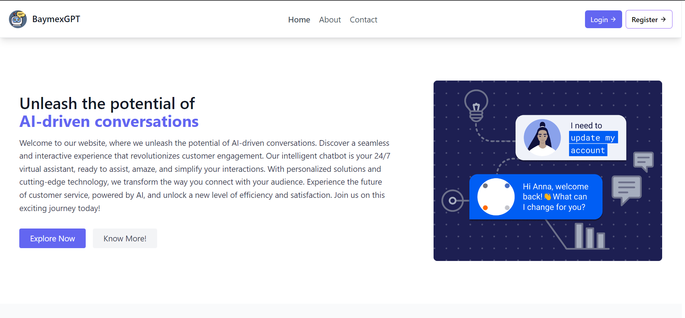
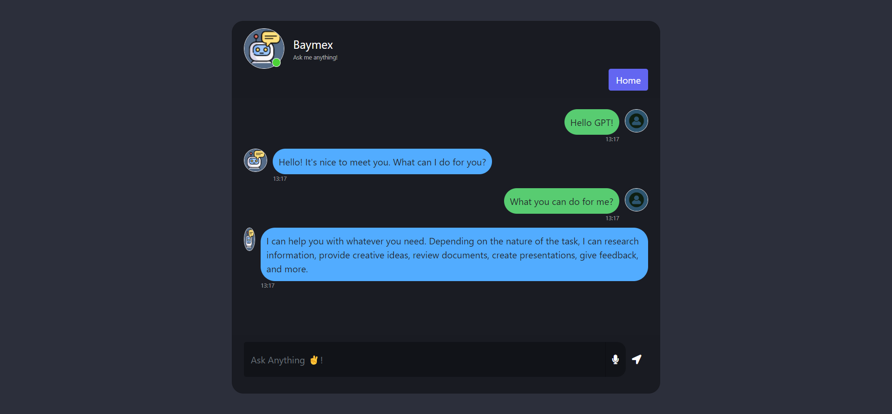
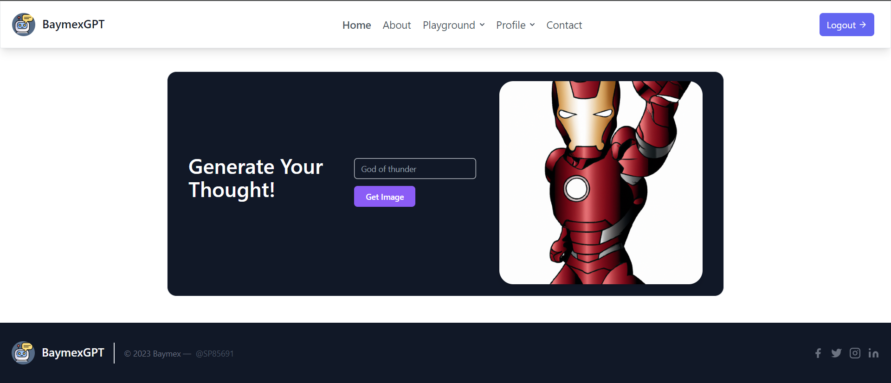
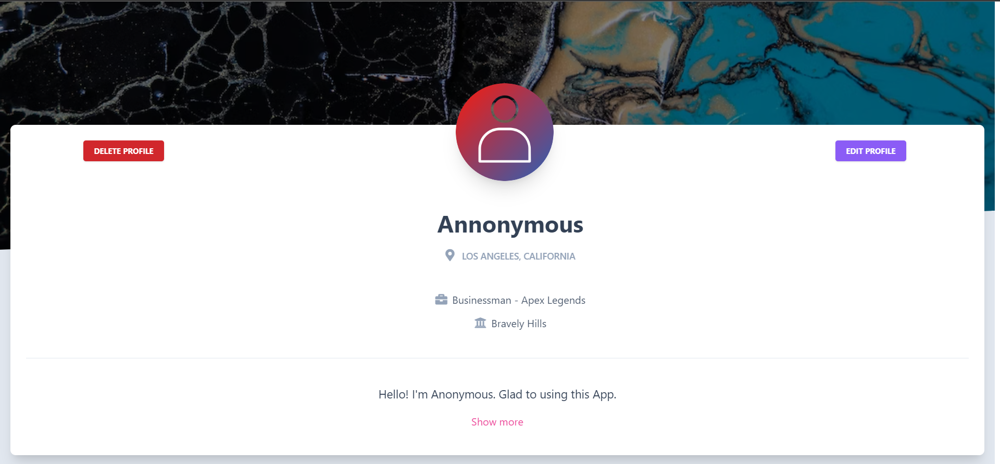
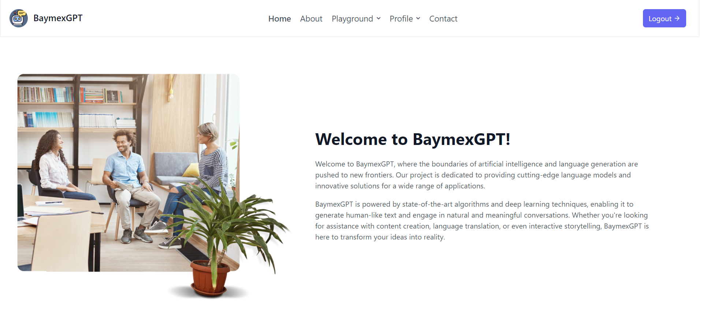
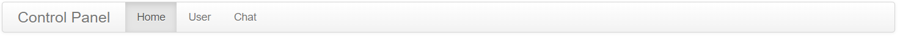

# ****BaymexGPT Flask Web Application****

Welcome to the BaymexGPT Flask Web Application! This project combines the power of AI, web development, and user interaction to deliver an engaging and versatile web application. Whether you want to have a conversation with an intelligent chatbot or generate stunning images from text prompts, BaymexGPT has got you covered.



## Introduction

BaymexGPT is a Flask-based web application that offers a unique and interactive user experience. With the integration of OpenAI's powerful language model, users can freely engage with the chatbot and ask questions on various topics. The chatbot utilizes cutting-edge natural language processing techniques to provide informative and engaging responses.

But that's not all! BaymexGPT also incorporates a text-to-image generation tool. Users can prompt the application with descriptive text, and it will generate images based on the provided input. This feature opens up a world of possibilities, from generating visual representations of concepts to creating unique and imaginative artwork.

## User Management

To enhance the user experience, BaymexGPT includes a comprehensive login and registration system. Users can create an account, securely log in, and manage their profile. Whether it's updating their information or deleting their account, users have full control over their personal data.

## Technology Stack

The BaymexGPT Flask Web Application leverages several technologies to deliver its functionality. The core technologies and tools used in this project include:

* **Python:** The primary programming language used for developing the backend logic and integrating the AI chatbot and text-to-image generation.
* **Flask:** A powerful web framework in Python used to build the web application and handle HTTP requests.
* **NPM:** A package manager for JavaScript used to manage and install dependencies for the front-end development.
* **JavaScript (JS):** The programming language used for client-side interactivity and handling dynamic elements on the web pages.
* **HTML/CSS:** The markup and styling languages used for structuring and presenting the web pages.
* **Tailwind CSS:** A utility-first CSS framework used to streamline the styling process and create a visually appealing interface.
* **OpenAI API:** The AI models from OpenAI are integrated into the application for natural language processing and text-to-image generation.
* **REST API:** The application uses a RESTful API architecture to handle communication between the front-end and back-end.
* **SQLAlchemy:** A Python library used as an Object-Relational Mapping (ORM) tool to interact with the database and manage user information securely.
* **Hashing:** User passwords are securely hashed to protect sensitive information.

## Project Structure

The project follows the following file directory structure:

```css
BaymexGPT_Flask_App
├── app
│   ├── blueprints
│   │   ├── auth.py
│   │   ├── main.py
│   │   └── openai.py
│   ├── static
│   │   ├── assets
│   │   │   ├── logo.png
│   │   │   └── etc.
│   │   ├── css
│   │   │   └── main.css
│   │   ├── js
│   │   │   └── scripts.js
│   │   └── input.css
│   ├── templates
│   │   ├── components
│   │   │   └── chat.html
│   │   ├── about.html
│   │   ├── base.html
│   │   ├── header.html
│   │   ├── footer.html
│   │   ├── hero.html
│   │   ├── contact.html
│   │   ├── text_to_image.html
│   │   ├── profile.html
│   │   ├── settings.html
│   │   ├── edit_profile.html
│   │   ├── login.html
│   │   ├── signup.html
│   │   ├── forgot_password.html
│   │   ├── testimonials.html
│   │   ├── error.html
│   │   ├── index.html
│   │   ├── playground.html
│   │   ├── settings.html
│   │   ├── pricings.html
│   │   └── services.html
│   ├── __init__.py
│   └── models.py
├── main.py
├── instance
│   └── gpt.sqlite3
├── venv
├── .env
├── .gitignore
├── requirements.txt
├── package.json
├── package-lock.json
└── tailwind.config.js
```

## Features

* AI-based chatbot for interactive user communication.

  
* Text-to-image generation tool.

  
* Login/register system for user authentication.

  
* User profile management (update/delete account).

  
* Various HTML/CSS templates for different pages.

  
* Static assets including logo and CSS/JS files.
* Database model for storing user information.

  

## Technology Used

The BaymexGPT Flask web application was developed using the following technologies:

* Python 3.10+
* NPM
* JavaScript (JS)
* HTML/CSS
* Tailwind CSS
* OpenAI API
* REST API
* SQLAlchemy (Database ORM)
* Hashing (for user password security)

## Author

This project was created by [Surya Pratap](https://github.com/SP85691/BaymexGPT_Flask_App).

## Date of Publication

This README was published on 30th May 2023.

Feel free to explore and contribute to this project!
